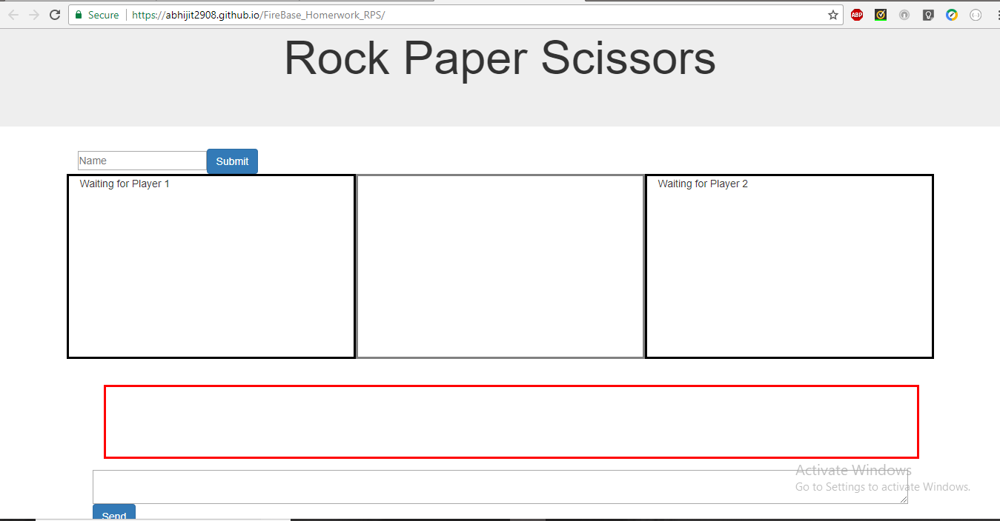
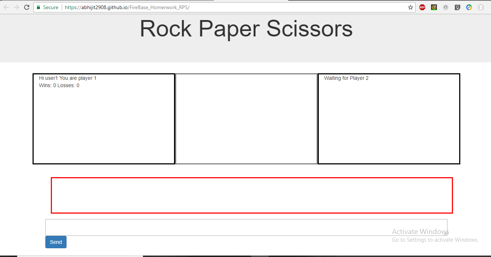
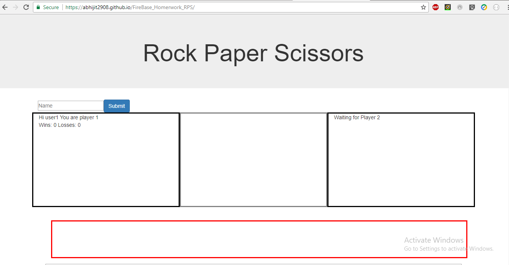
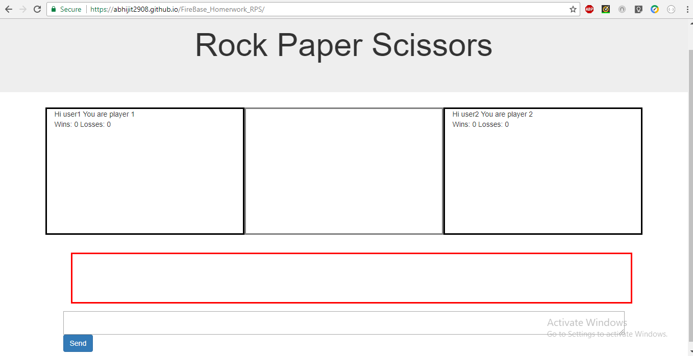
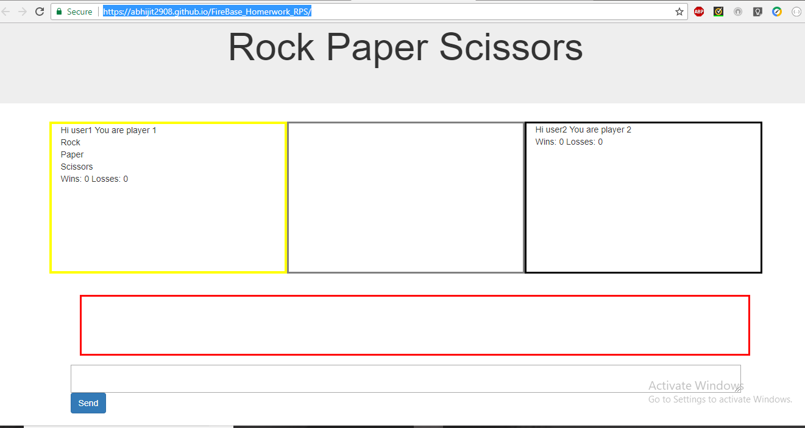
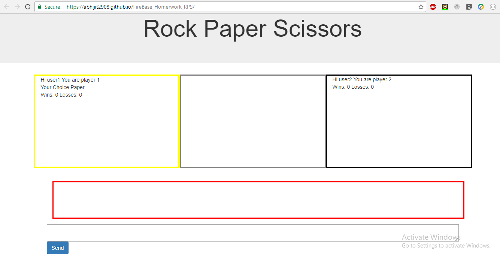
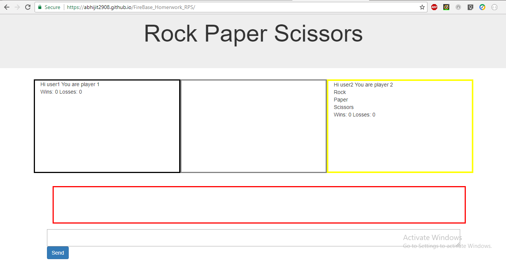
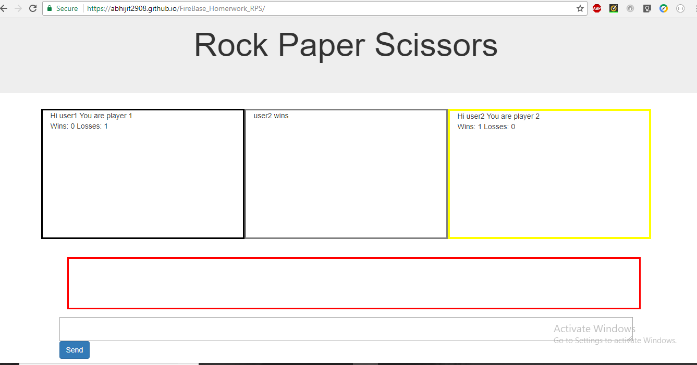
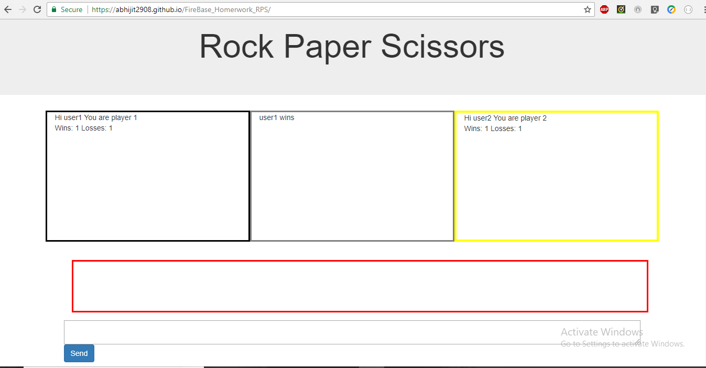
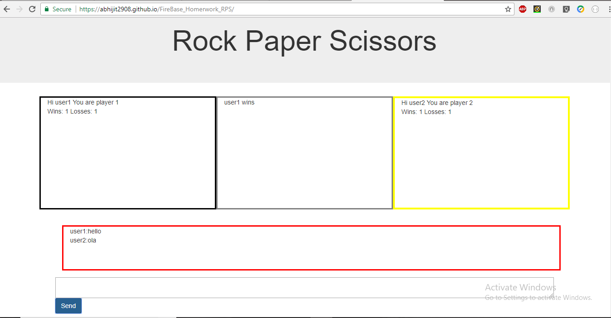

# FireBase_Homerwork_RPS

Rock,Paper and scissors is two player game. It is a virtual version of the conventional rock, paper and scissors.

It is built using HTMl/CSS/Javascript and Firebase is the databse.

The application is hosted on the following link: https://abhijit2908.github.io/FireBase_Homerwork_RPS/

* User 1 arrives at the landing page and enters in his name in the game and is ready to play

* User 2 arrives at the landing page and enters in his name in the game and is ready to play

* User 1 has his choice ready after user 2 is ready.The user 1 selects his choice.

* User 2 has his choice ready after user 1 chooses.The user 2 selects his choice and the result is displayed.

* The Users can chat with each other.

